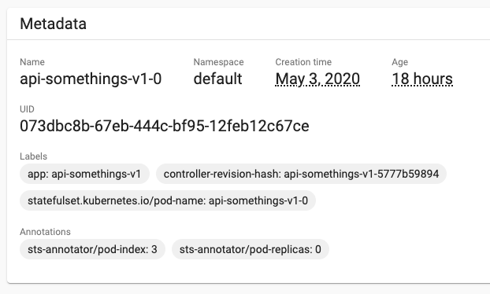

# sts-annotator

- [sts-annotator](#sts-annotator)
- [How it works](#how-it-works)
- [How to deploy](#how-to-deploy)
  - [Prerequisites](#prerequisites)
  - [Configurations](#configurations)
  - [Application Configuration (config.yaml)](#application-configuration-configyaml)
  - [MutatingWebhookConfiguration and TLS certs](#mutatingwebhookconfiguration-and-tls-certs)
  - [Deploy](#deploy)

sts-annotator is Kubernetes admission controllers, which is API providing custom admission review in your cluster. The goal of this controller is to allow pods to get `POD_INDEX` and `POD_REPLICAS` from Environment Variables. `sts-annotator` achieve it by adding annotations to any pods managed by Statefulset at the time of `CREATE` and `UPDATE`. The `POD_INDEX` is the pod's ordinal index suffixed to the Statefulset Pod Name.

If you want to understand basics, read [A Guide to Kubernetes Admission Controllers](https://kubernetes.io/blog/2019/03/21/a-guide-to-kubernetes-admission-controllers/).
If you want to understand required specifications over the custom APIs, read [Dynamic Admission Control](https://kubernetes.io/docs/reference/access-authn-authz/extensible-admission-controllers/).

# How it works

`sts-annotator` add annotations to any pods managed by Statefulset at the time of CREATE or UPDATE. It looks like below.

**A Statefulset POD (api-somethings-v1-0) is successfully annotated**  



**A Statefulset POD (api-somethings-v1-0) is successfully annotated**

```yaml
kind: Pod
apiVersion: v1
metadata:
  name: api-somethings-v1-sts-0
  namespace: default
  annotations:
    sts-annotator/pod-index: "0"
    sts-annotator/pod-replicas: "2"
```

You can get the annotations at your Environment variable, accessing to the annotations by `fieldRef`.

**How to get the pod-index and pod-replicas from Env Vars**

```yaml
apiVersion: apps/v1
kind: StatefulSet
metadata:
  name: "api-somethings-v1-sts"
spec:
  template:
    spec:
      containers:
        - env:
            - name: POD_INDEX
              valueFrom:
                fieldRef:
                  fieldPath: metadata.annotations['sts-annotator/pod-index']
            - name: POD_REPLICAS
              valueFrom:
                fieldRef:
                  fieldPath: metadata.annotations['sts-annotator/pod-replicas']
```

You can see the Environment variables correctly loaded when ssh into the pod.

**A Statefulset POD (api-somethings-v1-0) is successfully load env vars**

```sh
# POD: api-somethings-v1-sts-0, Statefulset Replicas: 3
$ env | grep POD
POD_REPLICAS=0
POD_INDEX=3
```

# How to deploy

## Prerequisites

- k8s cluster is running
- you have a set of server certificate, private key and certificate authority signed for your kubernetes master api

**If you don't know how to get the Certificate Authority**

It is also okay to generate new certificates by following [here](https://kubernetes.io/docs/concepts/cluster-administration/certificates/). But recommend you to discuss the certificate life cycle management with your system admin for production use.

Here is some tips to get Kubernetes Certificate Authority just in case if you don't know how to get the certificate authority.

1. run kubectl command  
  There is a chance to get Certificate Authority by the command below. However, you might not be able to get it in case that you use kubernetes service managed by cloud provider such as GKE,

    ```sh
    kubectl config view --raw --minify --flatten -o jsonpath='{.clusters[].cluster.certificate-authority-data}'
    ```

2. retrieve from pod  
  Pick up any pod you prefer and run the command below. You can copy the Kubernetes Master API Certificate Authority from POD.

    ```sh
    POD_NAME="<your/pod/name>"
    NAMESPACE="<your/namespace>"
    kubectl exec -n $NAMESPACE $POD_NAME -- tar cf - "/run/secrets/kubernetes.io/serviceaccount" | tar xf -
    ```

## Configurations

All configurations required are stored in [deployments/configs.yaml](deployments/configs.yaml). There are 3 types of configurations for `sts-annotator` - application, MutatingWebhookConfiguration, and tls certs.

## Application Configuration (config.yaml)

You can update [config.yaml](./deployments/configs.yaml) to configure the application. The `config.yaml` must be located in application root directory.

| field            | description                                                         |
| ---------------- | ------------------------------------------------------------------- |
| server.mode      | if you set 'debug', the api will run with 'debug' mode.             |
| server.log.level | log level, either of 'error' , 'info' or 'debug',                   |
| server.port      | port where the `sts-annotator` listens to                           |
| server.tls.cert  | path to the cert file for `sts-annotator.<namespace>.svc.cluster`   |
| server.tls.key   | path to the private key for `sts-annotator.<namespace>.svc.cluster` |
| k8s.url          | combination of url and port where your master api listens to        |
| k8s.token        | path to the k8s token file, used to call master api                 |
| k8s.tls.caCert   | path to the ca file, used to call master api                        |

## MutatingWebhookConfiguration and TLS certs

Please replace the `<REPLACE HERE BY ...>` items. Note, there are corelation between the two configurations. `sts-annotator` must run with https as Kubernetes Admission Controller requires. Please set the **Base64 Encoded Certificate Authority** (1), which signs server certificate (2). Kubernetes send webhook, expecting https server running with tls certs signed by the Certificate Authority. Set **Base64 Encoded Server Certificate** (2) and **Base64 Encoded Private Key** (3).

```yaml
---
apiVersion: admissionregistration.k8s.io/v1beta1
kind: MutatingWebhookConfiguration
metadata:
  name: sts-annotator
webhooks:
  - name: sts-annotator.default.svc
    clientConfig:
      service:
        name: sts-annotator
        path: /v1/sts/pod/annotation
        namespace: <REPLACE HERE BY YOUR NAMESPACE>
      caBundle: <REPLACE HERE BY YOUR BASE64 ENCODED CA>  ........... (1)
    rules:
      - operations:
          - CREATE
          - UPDATE
        apiGroups:
          - ""
        apiVersions:
          - "*"
        resources:
          - pods
    failurePolicy: Ignore

---
apiVersion: v1
kind: Secret
metadata:
  name: sts-annotator
  namespace: <REPLACE HERE BY YOUR NAMESPACE>
type: Opaque
data:
  server.crt: <REPLACE HERE BY YOUR BASE64 ENCODED CERT>         ... (2)
  server.key: <REPLACE HERE BY YOUR BASE64 ENCODED PRIVATE KEY>  ... (3)
```

## Deploy

Make sure you replace all the `<REPLACE HERE BY ...>` items in the yaml files.

```sh
kubectl create -f deployments/serviceaccount.yaml
kubectl create -f deployments/configs.yaml
kubectl create -f deployments/deploy.yaml
```

The next time you create Statefulset Pod, you will see pods annotated. Note, if you decrease the `spec.replicas` of the Statefulset while it's running, the annotation of existing pods won't be updated. This is because Environment Variables are loaded at the Pod initialization process, not read the annotations dynamically. If you want to change the pod replicas and keep the annotations corresponding to the number, you need to recreate the existing pods as well.
